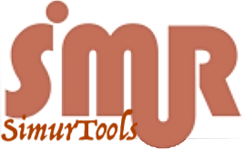

# SimurTools Library
> Matlab/Simulink tools widely used in the SiMuR Lab

## General info
This toolbox provides utilities to deal with the typical problems we find at the SiMuR Lab at the University of Oviedo, related to human and robot motion capture and analysis.
Help in: http://simurtools.dieecs.com

## Technologies
Other toolboxes and Simulink tools are ocassionally used: Robotics Systems Toolbox, Sensor Fusion Toolbox, Simscape

## Setup
Download from the AddsOn Manager inside Matlab

## Code Examples
Examples of usage in the Matlab AddsOn Manager

## Features
the tools provided can be grouped in three categories: robot motion related tools, human motion analysis with IMUs and general use tools.
Some robot models are included. Some database examples are provided. 

## Status
Project is _in progress_ 

#########  Release History  #########  
v 1.1 (R2020a)	Sep 2020      Updated for R2020a
                              Made available in Adds-on utility

v 1.0 (R2019b)	Mar 2019      Updated for R2019b
                              Uses MATLAB Project

## Contact
Created by [@simurlab](https://simur.dieecs.com/) - feel free to contact me!

Copyright 2017-2020 SiMuR Lab

